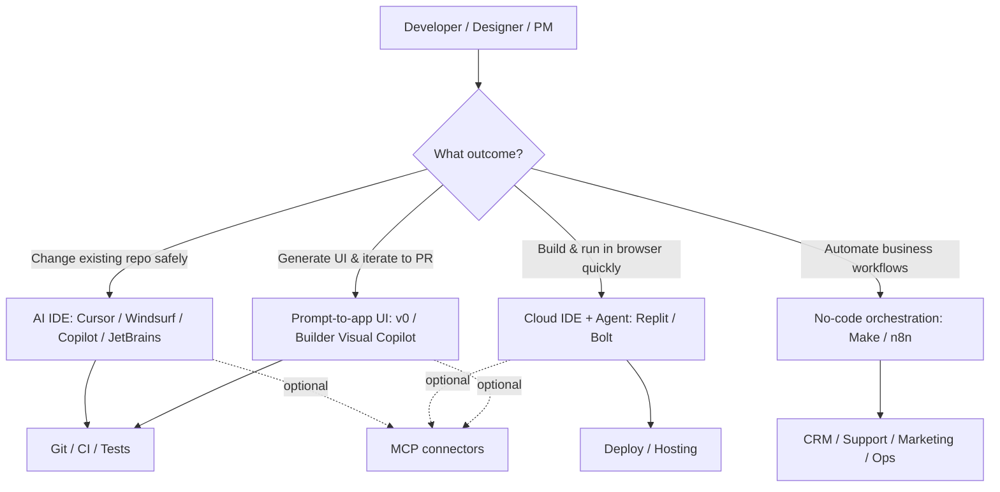
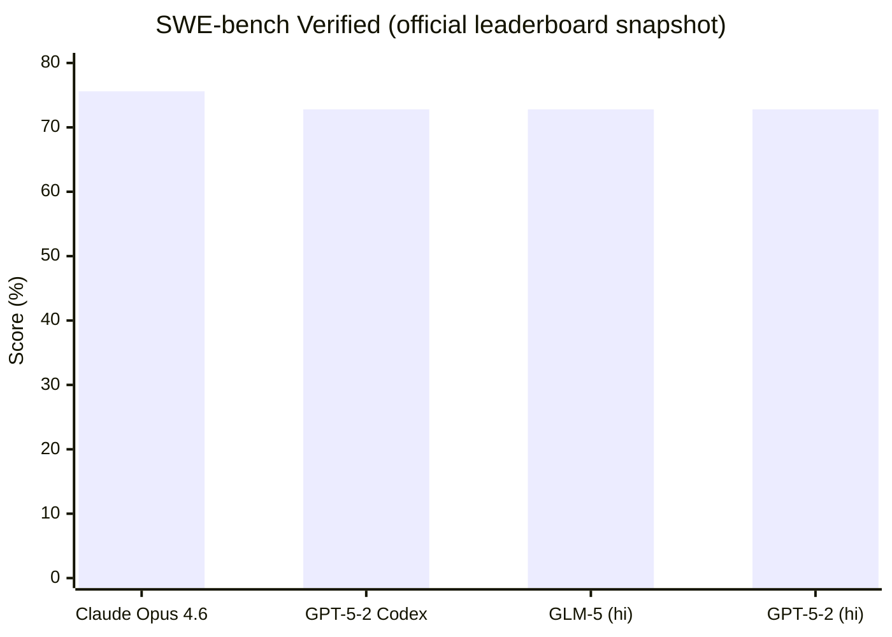
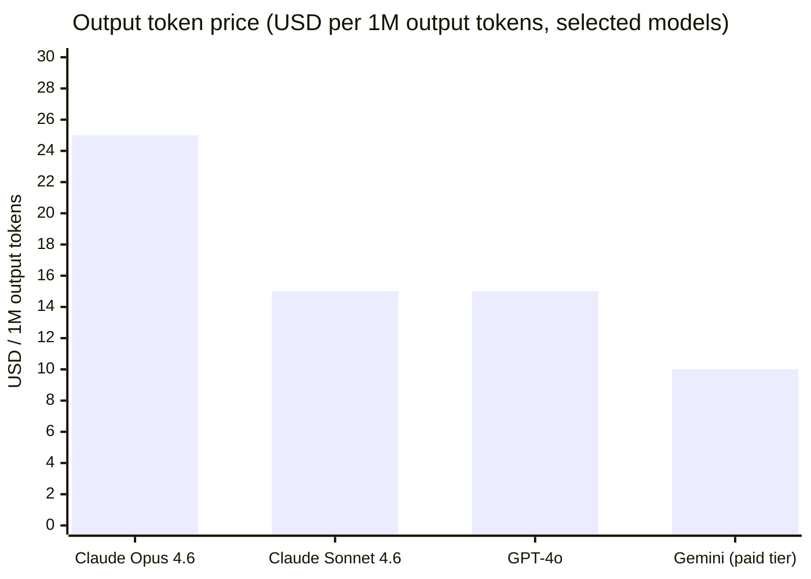
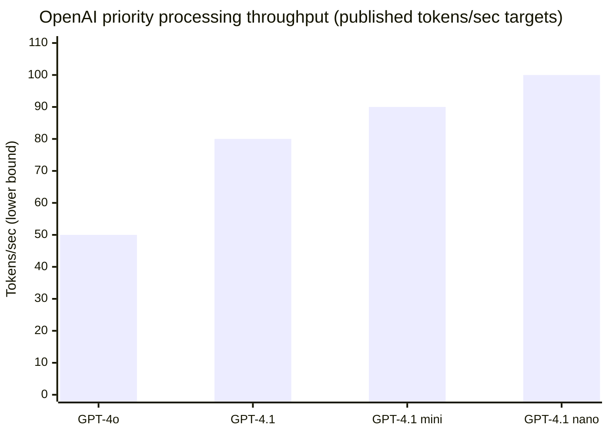

# AI-powered IDEs and AI code-writing builder platforms for 2026: an evidence-driven bilingual comparison for publication

## Executive summary

**English (EN)**  
AI “code-writing” tools in 2026 fall into four practical buckets: (1) AI-native IDEs (local editors that understand your repo and refactor multi-file code), (2) cloud IDE + agents (build, run, deploy in the browser), (3) prompt-to-app UI builders (generate production-ish frontends fast), and (4) no-code automation orchestrators (turn business workflows into reliable, monitored pipelines). The biggest mistake teams make is comparing them as if they were the same product. They are not: a local IDE is about *safe change inside an existing codebase*, whereas a prompt-to-app builder is about *speed to a prototype*, and automation tools are about *repeatability, auditability, and integration*. citeturn13search3turn13search19turn13search0  

On quality, the practical ceiling is set by the underlying models and the scaffolding around them. Public leaderboards show frontier models reaching ~70–75%+ on SWE-bench Verified (multi-file bug-fixing tasks), but those results depend heavily on agent scaffolding and are not a guarantee for any specific tool. citeturn6search3turn6search11  

On governance, the technical differentiators that actually matter for B2B are: ability to **turn off model training / minimise retention**, **SSO/SCIM**, **audit logs**, **policy controls**, and a **prompt-injection threat model**, especially when you connect external tools via MCP (Model Context Protocol). citeturn13news38turn13search2turn13search5turn16search1  

**Recommended pilot shortlist for YappiX (3 tools):**  
1) **Cursor** — best “AI IDE” baseline for multi-file work in real repos; strong enterprise controls and a mature agent workflow. citeturn14search1turn10search0turn0search4  
2) **v0 (Vercel)** — best “prompt-to-PR” frontend accelerator for Next.js/React stacks; has GitHub sync and enterprise seat management; clear AI training policy by plan. citeturn14search0turn5search25turn7search13  
3) **n8n** (self-host or enterprise) — best orchestration layer to make AI work repeatable (PR checks, content pipelines, lead ops) with Git-backed environments and strong security posture. citeturn15search2turn15search1turn3search1  

**Русский (RU)**  
AI-инструменты “которые пишут код” в 2026 делятся на 4 класса: (1) AI‑IDE для работы в существующем репозитории, (2) облачные IDE + агенты (строят/запускают/деплоят), (3) prompt‑to‑app генераторы интерфейсов, (4) no‑code оркестраторы автоматизаций. Сравнивать их “в лоб” — ошибка: у каждого свой тип результата и рисков. citeturn13search3turn13search19turn13search0  

Качество упирается в модели и “обвязку” агента. Лидерборды показывают сильные результаты на SWE‑bench Verified, но это не гарантия для конкретного продукта без вашего процесса измерения. citeturn6search3turn6search11  

Для B2B решают не “вау‑демки”, а controllability: training opt‑out/ретенция, SSO/SCIM, аудит‑логи, политики и модель угроз (prompt injection), особенно при интеграциях через MCP. citeturn13news38turn13search2turn16search1  

Пилот‑трио для YappiX: Cursor + v0 + n8n. citeturn14search1turn14search0turn15search2  

## Landscape and taxonomy

A useful way to classify tools is by **where code “lives”** (local repo vs hosted workspace), and by **what the AI is allowed to do** (single-file suggestions vs multi-file planning + execution + testing + deployment). MCP is now the “universal connector” that lets agents fetch context from external systems, but it also expands the attack surface (prompt injection, tool misuse, data exfiltration). citeturn13search1turn13search2turn13news38  



image_group{"layout":"carousel","aspect_ratio":"16:9","query":["Cursor AI IDE screenshot","Replit Agent build app screenshot","Bolt.new AI builder screenshot","Vercel v0 generative UI screenshot","Figma Make prompt-to-app screenshot"],"num_per_query":1}  

**Key implication:** you should benchmark *workflows*, not just “who writes nicer functions.” That means measuring: time to green tests, number of agent loops, diff quality, security regressions, and total cost (including reruns). Public benchmarks like SWE-bench and EvalPlus are valuable for model selection, but platform benchmarking needs your repo-specific harness. citeturn6search3turn8search7turn8search1  

**RU (кратко):** классифицируйте по “где живёт код” и “какие действия разрешены ИИ”. MCP объединяет интеграции, но добавляет риски и требует threat model. Бенчмарки нужно строить как измерение workflow, а не красивости кода. citeturn13search1turn13news38turn8search7  

## Platform profiles

Below are publication-ready profiles. If a field lacks public data, it is marked **Unspecified**.

### Cursor (AI-native local IDE)

- **Product name:** Cursor  
- **URL:** `https://cursor.com`  
- **Company:** entity["company","Anysphere","cursor maker"] citeturn7search3turn14search1  
- **Core use-case:** multi-file edits, refactors, agentic tasks inside existing repos; forked from VS Code (familiar UX). citeturn7search3turn9search25  
- **Supported languages:** broad (LLM-based); best fit for JS/TS, Python, common web stacks (practically “anything you can diff + test”). citeturn9search25turn14search1  
- **Models / integrations:** frontier models across providers; supports MCP, skills, hooks, and cloud agents depending on plan. citeturn14search1turn0search3  
- **Key features:** MCP/skills/hooks; cloud agents; enterprise audit log + “AI code tracking API” on enterprise; team rules and admin controls. citeturn14search1turn10search15turn0search4  
- **Pricing tiers:** Hobby (free), Pro ($20/mo), Pro+ ($60/mo), Teams ($40/user/mo), Enterprise (custom). citeturn14search1  
- **Enterprise options:** SSO (SAML/OIDC), SCIM, audit logs, pooled usage, invoice/PO billing. citeturn14search1turn10search8  
- **Security/compliance:** SOC 2 Type II; trust centre available; annual pen testing stated. citeturn10search0turn10search12  
- **Extensibility:** MCP ecosystem; import context from tools via connectors; policy via team rules/hooks. citeturn0search4turn13search0  
- **Maturity / GA:** publicly released 2023 (widely adopted). citeturn7search3  
- **Notable customers:** entity["company","Stripe","payments company"] (public quote), entity["company","NVIDIA","chip company"] (published customer story). citeturn9search1turn9search13  

### GitHub Copilot (IDE + platform assistant)

- **Product name:** GitHub Copilot  
- **URL:** `https://github.com/features/copilot`  
- **Company:** entity["company","GitHub","code hosting platform"] (owned by entity["company","Microsoft","tech company"]). citeturn16search6turn16search15  
- **Core use-case:** inline suggestions + chat, integrated across IDEs and GitHub; strong fit for code completion and “explain/fix” tasks. citeturn16search5turn16search6  
- **Supported languages:** broad; trained on public code, optimised for common languages and frameworks. citeturn16search6  
- **Models / integrations:** models developed with OpenAI and Microsoft; supports additional agents (Claude/Codex) in preview for some plans (consumes premium requests). citeturn16search6turn16news40  
- **Key features:** IDE chat + completions; policy controls for organisations; can block suggestions matching public code (Business controls). citeturn16search6turn16search12  
- **Pricing tiers:** Business $19/user/month; Enterprise $39/user/month; additional billing rules for orgs. citeturn16search10turn16search16  
- **Enterprise options:** governance and trust centre documentation; enterprise logging on GitHub platform side. citeturn16search15turn11search9  
- **Security/compliance:** Trust Centre includes retention specifics; prompts/suggestions may be retained depending on access path; Business/Enterprise data not used to train models. citeturn16search1turn16search18  
- **Extensibility:** deep GitHub integration; policies per org; integrates into workflow (issues/PRs). citeturn16search6turn16search32  
- **Maturity / GA:** widely deployed since early 2020s; continuous expansion via GitHub platform updates. citeturn16search19  
- **Notable customers:** Unspecified in a single canonical vendor list (varies by case study/program).

### Windsurf (AI-native IDE by Codeium)

- **Product name:** Windsurf  
- **URL:** `https://windsurf.com`  
- **Company:** entity["company","Codeium","ai code assistant company"] citeturn10search2turn2search0  
- **Core use-case:** AI-native IDE with agent (“Cascade”) for multi-file work; focuses on keeping devs in flow with repo-wide context. citeturn2search2turn9search11  
- **Supported languages:** broad; positioned for multi-language codebases; specifics depend on chosen model. citeturn2search2  
- **Models / integrations:** supports multiple leading model providers; enterprise plan with model/provider controls. citeturn2search2turn9search11  
- **Key features:** agentic coding workflow; enterprise governance; IDE-level experience rather than web builder. citeturn9search11turn2search1  
- **Pricing tiers:** public pricing varies; enterprise available. citeturn2search0turn2search1  
- **Security/compliance:** SOC 2 Type II and annual third‑party pen testing stated on security page/trust centre process. citeturn10search6turn10search2  
- **Extensibility:** integrations + model selection; participates in MCP ecosystem through external integrations (varies by toolchain). citeturn7news39turn13search0  
- **Maturity / GA:** actively used in enterprise rollouts; public third-party reports exist. citeturn9search2  
- **Notable customers:** entity["company","ServiceNow","enterprise software company"] reported 10% productivity boost in a large rollout (third-party report). citeturn9search2turn9search11  

### JetBrains AI Assistant (in-IDE assistant)

- **Product name:** JetBrains AI Assistant  
- **URL:** `https://www.jetbrains.com/ai/`  
- **Company:** entity["company","JetBrains","ide vendor"] citeturn2search8turn16search3  
- **Core use-case:** AI features inside IntelliJ/IDEA, PyCharm, WebStorm, etc; strong fit for “explain, generate, refactor” in JetBrains workflows. citeturn16search3  
- **Supported languages:** broad across JetBrains IDEs (Java/Kotlin/Python/JS/TS/etc). citeturn16search3  
- **Models / integrations:** Unspecified (JetBrains uses a mix of providers and their own components depending on region/product). What is public: detailed data handling terms and opt-in collection. citeturn16search3turn16search14  
- **Key features:** IDE-native integration; organisation controls depend on deployment/licensing. citeturn16search25  
- **Pricing tiers:** sold as an add-on / plan depending on product licensing. citeturn2search8  
- **Enterprise options:** business/enterprise positioning exists; details are contract-dependent. citeturn16search29  
- **Security/compliance (important nuance):** JetBrains documents that opt-in detailed data collection can include full communication with the LLM (text + code fragments) and may be used for product improvement and training AI models, while remaining confidential (not shared externally). citeturn16search3turn16search25  
- **Extensibility:** JetBrains plugin ecosystem (non-AI); AI customisation limited vs “bring-your-own model” tools. citeturn16search3  
- **Maturity / GA:** mature IDE suite integration, continuously iterated. citeturn16search3  
- **Notable customers:** Unspecified (JetBrains has broad enterprise adoption across IDEs, but AI Assistant customer list is not a single canonical source).

### Continue (open-source assistant for VS Code / JetBrains)

- **Product name:** Continue  
- **URL:** `https://www.continue.dev`  
- **Company/Project:** entity["organization","Continue","open-source ai coding"] citeturn2search4turn2search5  
- **Core use-case:** “bring-your-own model” assistant embedded in IDE; best for teams needing self-hosting, model choice, or strict governance. citeturn2search4turn2search5  
- **Supported languages:** broad; depends on model and IDE. citeturn2search4  
- **Models / integrations:** integrates with multiple model providers and local/self-hosted models; designed for configurability. citeturn2search4turn2search5  
- **Key features:** open-source extensibility; policy can be enforced via config; good for controlled environments. citeturn2search4  
- **Pricing tiers:** core is open-source; commercial options **Unspecified** in the public profile here. citeturn2search5  
- **Enterprise options:** typically self-managed; enterprise support depends on vendor/community arrangements. citeturn2search5  
- **Security/compliance:** governance is “you own your boundary” (self-host, audit, DLP). citeturn2search4  
- **Extensibility:** high; can integrate with internal gateways; can be combined with MCP/other protocols via your stack. citeturn13search0turn2search4  
- **Maturity / GA:** mature open-source project with active development. citeturn2search5  
- **Notable customers:** Unspecified (open-source adoption is diffuse).

### Replit Agent (cloud IDE + autonomous build)

- **Product name:** Replit Agent  
- **URL:** `https://replit.com`  
- **Company:** entity["company","Replit","cloud ide company"] citeturn7search2turn9search3  
- **Core use-case:** build apps end-to-end in the browser (generate code, run, preview, deploy); good for non-devs shipping internal tools and prototypes. citeturn9search23turn7search2  
- **Supported languages:** broad; includes web stacks and supports mobile workflows (reported by vendor updates). citeturn7search5turn9search23  
- **Models / integrations:** Agent v2 announced in partnership with Anthropic Claude 3.7 Sonnet launch; vendor also documents use of Claude on Google Cloud in a customer case study. citeturn7search2turn9search12  
- **Key features:** integrated hosting/deploy; database/auth; enterprise security positioning. citeturn9search23turn10search3  
- **Pricing tiers:** public plans vary; “paid plans” gate some advanced capabilities; exact pricing shifts over time. citeturn7search2turn0search7  
- **Enterprise options:** enterprise platform offering; SSO/SCIM and security controls described in docs. citeturn9search23turn10search17  
- **Security/compliance:** SOC 2 statements and enterprise controls documented. citeturn10search3turn10search7  
- **Extensibility:** integrations within Replit ecosystem; connects to external APIs; governance depends on plan. citeturn9search23turn10search17  
- **Maturity / GA:** Agent v2 announced Feb 2025 (early access initially). citeturn7search2  
- **Notable customers:** Replit maintains customer stories page (examples include Musixmatch and Plaid). citeturn9search3  

### Bolt.new (StackBlitz cloud builder + hosting)

- **Product name:** Bolt.new  
- **URL:** `https://bolt.new`  
- **Company:** entity["company","StackBlitz","browser ide company"] citeturn5news39turn12search28  
- **Core use-case:** build and deploy web apps in-browser with an AI-driven workspace; strong for fast MVPs and demos; includes integrated hosting. citeturn5search16turn12search28  
- **Supported languages:** web-centric (Node/JS ecosystems via WebContainers); multi-stack as supported by platform templates. citeturn12search28turn5search23  
- **Models / integrations:** vendor blog indicates rapid model updates (e.g., Claude Sonnet/Opus “landed in Bolt” posts); exact per-plan model matrix varies. citeturn12search17turn5news39  
- **Key features:** publish/hosting to `.bolt.host`; database security audit UI exists; team features expanding. citeturn5search16turn12search5turn12search17  
- **Pricing tiers:** token-based plans (Free → Pro tiers; Teams/Enterprise described); exact token amounts/tiers on pricing page. citeturn12search11  
- **Enterprise options:** pricing page references advanced security (SSO, audit logs, compliance support) and governance/retention policies (details contract-dependent). citeturn12search11  
- **Security/compliance:** public SOC2 statement not found in Bolt.new primary sources in this dataset; treat compliance as **Unspecified** unless confirmed in a trust centre or contract. (Bolt.new does provide “code ownership” guidance and security tooling in-product.) citeturn12search25turn12search5turn12search11  
- **Extensibility:** can export code; open-source sibling project bolt.diy illustrates WebContainer-based architecture. citeturn12search25turn5search23  
- **Maturity / GA:** launched Oct 2024 (reported). citeturn5news39  
- **Notable customers:** Unspecified (rapid consumer-scale adoption reported in press, but customer list is not a single canonical vendor page). citeturn5news39  

### v0 (Vercel prompt-to-app + Git workflows)

- **Product name:** v0  
- **URL:** `https://v0.app`  
- **Company:** entity["company","Vercel","deploy platform company"] citeturn7search7turn14search0  
- **Core use-case:** generate UI/apps fast (especially Next.js/React/Tailwind/shadcn); iterate and push into git workflows; “prompt → build → publish”. citeturn5search13turn14search20  
- **Supported languages/frameworks:** best-in-class Next.js/React/Tailwind/shadcn; supports popular front-end frameworks and UI libs. citeturn5search13  
- **Models / integrations:** composite model family described by Vercel; platform API provides programmatic text-to-app pipeline (generation + parsing + auto-fix + preview). citeturn7search13turn7search1  
- **Key features:** Design Mode for visual edits; GitHub sync; deploy to Vercel; templates; v0 Platform API (beta). citeturn14search0turn7search13  
- **Pricing tiers:** Free ($5 credits/mo), Premium ($20/mo), Team ($30/user/mo), Business ($100/user/mo), Enterprise (custom). citeturn14search0turn14search3  
- **Enterprise options:** seat/access managed via Vercel enterprise account; integrates into enterprise org management. citeturn11search1turn14search6  
- **Security/compliance:** AI policy states enterprise plan data is not used/shared for model training; opt-out is plan/setting dependent. citeturn5search25turn14search0  
- **Extensibility:** Platform API + GitHub sync are the practical extensibility points; works best with Vercel deployment workflows. citeturn7search13turn14search20  
- **Maturity / GA:** announced Oct 2023; major “new v0” push in Feb 2026. citeturn7search7turn7search1  
- **Notable customers:** Vercel describes enterprise use cases; individual customer logos vary by campaign (no single canonical list in sources above). citeturn7search1  

### Figma Make (prompt-to-app inside design ecosystem)

- **Product name:** Figma Make  
- **URL:** `https://www.figma.com/make/`  
- **Company:** entity["company","Figma","design software company"] citeturn7search15turn7search23  
- **Core use-case:** prompt-to-app/prototype creation from within Figma ecosystem; designed to let teams test, iterate, and move from idea to interactive prototype. citeturn7search23turn7news40  
- **Supported languages:** primarily web prototype output; exact code export formats **Unspecified** (varies by feature rollout). citeturn7news40  
- **Models / integrations:** incorporates MCP server so AI tools can access deeper design/code context; supports integrations with AI agents/IDEs via MCP expansions. citeturn7news39turn13search5  
- **Key features:** Make + MCP; “design snapshot” roadmap reported; ecosystem positioning. citeturn7news39turn7search23  
- **Pricing tiers:** tied to Figma plan availability; rollout varies by plan/region (not a single stable price for Make standalone). citeturn7news40turn7search15  
- **Enterprise options:** Figma enterprise security controls exist; Trust Centre available. citeturn11search0turn11search8  
- **Security/compliance:** Figma states SOC 2 Type II completion and provides org privacy/security documentation. citeturn11search12turn11search0  
- **Extensibility:** MCP connectors are the main extensibility story; must be governed carefully. citeturn7news39turn13news38  
- **Maturity / GA:** announced at Config 2025 (May 2025). citeturn7search15turn7search23  
- **Notable customers:** Figma’s AI pages show “trusted by teams at …” logos (examples include Elgato, OneSignal, H&R Block, ServiceNow). citeturn1search1  

### Builder.io Visual Copilot (design-to-code + enterprise workflow)

- **Product name:** Builder.io Visual Copilot  
- **URL:** `https://www.builder.io`  
- **Company:** entity["company","Builder.io","visual development platform"] citeturn1search4turn11search11  
- **Core use-case:** convert Figma designs to production code/components and integrate into enterprise workflows (design systems, git, CI/CD). citeturn11search27turn1search4  
- **Supported languages/frameworks:** multi-framework outputs (React/Next.js and others); exact matrix depends on product configuration. citeturn1search4turn11search27  
- **Models / integrations:** Vendor describes use of an in-house fine-tuned model for design-to-code; supports “choose your preferred LLM” in enterprise positioning. citeturn1search4turn11search11  
- **Key features:** enterprise-ready visual development; git provider integration; governance features (RBAC/SSO). citeturn11search11turn11search31  
- **Pricing tiers:** vendor pricing exists; enterprise plan marketed separately (exact tiers vary). citeturn1search3turn11search11  
- **Enterprise options:** SOC 2 Type II, SSO/SAML; “no data training” enterprise claim and LLM choice. citeturn11search11turn11search3  
- **Security/compliance:** SOC 2 Type II; GDPR compliance documentation published. citeturn11search3turn11search7  
- **Extensibility:** strong integration story (design systems, component libs, git/CI). citeturn11search27  
- **Maturity / GA:** Visual Copilot publicly launched earlier; actively marketed for enterprise. citeturn11search15  
- **Notable customers:** Unspecified in a single canonical list on sources above (vendor has enterprise adoption references, but customer logos vary).

### Make.com (no-code automation with enterprise controls)

- **Product name:** Make  
- **URL:** `https://www.make.com`  
- **Company:** entity["company","Make","automation platform make.com"] citeturn15search3turn14search2  
- **Core use-case:** orchestrate multi-step business automations (integrations, ETL-like flows, AI steps), with ops controls and audit paths. citeturn15search3turn15search16  
- **Supported languages:** no-code modules; custom code possible via functions/modules depending on plan. citeturn15search3turn15search28  
- **Models / integrations:** AI via integrations (e.g., OpenAI modules) and workflow building aids; primary value is app connectivity and governance at scale. citeturn15search3turn15search28  
- **Key features:** enterprise audit logs; analytics dashboards; SLA and support tiers for enterprise. citeturn15search16turn15search7turn14search2  
- **Pricing tiers:** public pricing page (Free + paid tiers + Enterprise). citeturn15search3  
- **Enterprise options:** 99.5% uptime for enterprise; defined support SLAs; separate AWS environment for enterprise. citeturn14search2  
- **Security/compliance:** ISO 27001 certified security program; infrastructure described as compliant with SOC 2 Type II / SOC3 (per vendor security page). citeturn14search2  
- **Extensibility:** many connectors; enterprise governance features; good for repeatable pipelines. citeturn15search3turn15search16  
- **Maturity / GA:** mature automation platform with enterprise track. citeturn14search2  
- **Notable customers:** Unspecified in a single canonical list within sources above.

### n8n (automation orchestration, self-hostable)

- **Product name:** n8n  
- **URL:** `https://n8n.io`  
- **Company:** entity["company","n8n","automation workflow tool"] citeturn15search0turn15search1  
- **Core use-case:** automate workflows with strong developer ergonomics; can be hosted or self-hosted; AI workflow builder credits exist on cloud plans. citeturn15search0turn3search1  
- **Supported languages:** no-code nodes + code nodes; extensible workflow logic. citeturn3search1turn15search0  
- **Models / integrations:** AI integrations and AI workflow building docs exist; main value is orchestrating tool calls with retries/logging/approvals. citeturn3search1turn3search0  
- **Key features:** Git-backed source control and environments (branch-backed); enterprise security posture with SOC reporting. citeturn15search2turn15search1  
- **Pricing tiers:** cloud plans listed publicly (Starter/Pro etc); self-host is an option. citeturn15search0  
- **Enterprise options:** SOC report availability (enterprise-access); SOC3 downloadable; enterprise support contract-dependent. citeturn15search1  
- **Security/compliance:** n8n publishes SOC statements and security program notes. citeturn15search1  
- **Extensibility:** high; can integrate with git, CI, ticketing, CRMs; supports CI-like patterns via source control. citeturn15search2turn15search31  
- **Maturity / GA:** mature; documented source control features. citeturn15search2  
- **Notable customers:** Unspecified (varies by community showcase and enterprise deals).

## Feature, pricing, and enterprise comparison tables

### Capability comparison (platforms vs practical workflow capabilities)

Legend: **✓** = built-in / first-class, **△** = partial / depends on plan, **—** = not primary, **BYO** = bring your own (model/infra), **Local** = offline/local possible.

| Platform | Multi-file repo work | Run/preview built-in | CI/CD & git workflow | Debug & tests loop | Collaboration | Plugins / integrations | Offline/self-host | Model choice | Admin / audit / IAM |
|---|---:|---:|---:|---:|---:|---:|---:|---:|---:|
| Cursor | ✓ | △ (local dev) | ✓ | ✓ | ✓ | ✓ (MCP/hooks) | △ (local editor; models remote) | ✓ | ✓ |
| GitHub Copilot | △ | — | ✓ | △ | ✓ | △ | — | △ | ✓ |
| Windsurf | ✓ | △ | ✓ | ✓ | ✓ | △ | — | ✓ | ✓ |
| JetBrains AI | △ | — | ✓ | △ | ✓ | △ | — | △ | △ |
| Continue | ✓ | △ | ✓ | △ | △ | ✓ | **Local/BYO** | **BYO** | **BYO** |
| Replit Agent | ✓ | ✓ | △ | △ | ✓ | △ | — | △ | ✓ |
| Bolt.new | △ | ✓ | △ | △ | ✓ | △ | △ (bolt.diy) | △ | △ |
| v0 | △ | ✓ (preview + deploy) | ✓ (GitHub sync) | △ | ✓ | ✓ (API) | — | △ | ✓ (by plan) |
| Figma Make | — | ✓ (prototype) | △ | — | ✓ | ✓ (MCP) | — | △ | ✓ (Figma org) |
| Builder Visual Copilot | △ | △ | ✓ | △ | ✓ | ✓ | — | ✓ (enterprise) | ✓ |
| Make.com | — | — | △ | △ | ✓ | ✓ | — | ✓ (via connectors) | ✓ |
| n8n | — | — | ✓ (git envs) | ✓ (retries/logs) | ✓ | ✓ | ✓ (self-host) | ✓ | ✓ |

This matrix is derived from each vendor’s published feature claims: Cursor plan includes MCP/skills/hooks and enterprise audit/SSO/SCIM. citeturn14search1turn10search8 GitHub Copilot describes context sent from IDE and enterprise governance via trust centre. citeturn16search6turn16search15 v0 supports GitHub sync and offers a Platform API for its generation pipeline. citeturn14search0turn7search13 n8n documents Git-backed environments. citeturn15search2 Make documents audit logs in enterprise. citeturn15search7turn15search16  

### Pricing snapshot (public list prices; excludes negotiated enterprise)

| Tool | Entry paid tier (public) | Team tier (public) | Cost model notes |
|---|---:|---:|---|
| Cursor | $20/mo | $40/user/mo | credit pools + model-dependent usage citeturn14search1turn14search29 |
| GitHub Copilot | $19/user/mo (Business) | $39/user/mo (Enterprise) | premium request overages possible citeturn16search16turn16search10 |
| v0 | $20/mo (Premium) | $30/user/mo (Team) | credits + plan-based training controls citeturn14search0turn5search25 |
| Bolt.new | token plans on pricing page | teams described | token consumption is dominant cost driver citeturn12search11turn5news40 |
| Replit | paid plans vary | enterprise custom | credits + hosting/runtime costs apply citeturn9search23turn0search7 |
| Make.com | paid tiers vary | enterprise custom | “credits per module action” pricing citeturn15search3 |
| n8n (cloud) | €20/mo (Starter annual) | higher tiers | executions-based; self-host is an option citeturn15search0 |

### Enterprise governance features (what procurement actually asks)

| Tool | Training opt-out stance | SSO | SCIM | Audit logs | SOC evidence |
|---|---|---:|---:|---:|---|
| Cursor | privacy mode + enterprise controls | ✓ | ✓ | ✓ | SOC 2 Type II citeturn14search1turn10search0 |
| GitHub Copilot | Business/Enterprise not used for training | ✓ (org-managed) | ✓ (GitHub enterprise) | ✓ | Trust centre docs citeturn16search18turn16search1 |
| Windsurf | Unspecified per plan (see trust centre) | ✓ (enterprise) | ✓ (enterprise) | △ | SOC 2 Type II citeturn10search6turn2search1 |
| v0 | Enterprise not used/shared for training | ✓ (via Vercel) | △ | ✓ (via Vercel) | policy by plan citeturn5search25turn11search5 |
| Figma | org controls, trust centre | ✓ | ✓ | ✓ | SOC 2 Type II citeturn11search12turn11search8 |
| Builder.io | “no data training” enterprise claim | ✓ | △ | △ | SOC 2 Type II citeturn11search11turn11search3 |
| Make.com | enterprise isolated AWS + SLAs | ✓ | △ | ✓ | ISO 27001; SOC infra claims citeturn14search2turn15search7 |
| n8n | SOC 2 report for enterprise | △ | Unspecified | △ | SOC 2/SOC 3 docs citeturn15search1 |

**RU (кратко):** сравнение должно отвечать на вопросы: “можно ли безопасно менять существующий репо?”, “есть ли Git/CI путь?”, “какие IAM/аудит/retention?”, “какая модель затрат?”. Таблицы выше опираются на публичные страницы вендоров. citeturn14search1turn14search0turn15search2turn16search1  

## Benchmarking plan and baseline results

### What you can benchmark reproducibly

There are two layers:

1) **Model baseline** (public leaderboards): helps decide which model family to prefer when a platform lets you choose models. SWE-bench Verified is a respected multi-file bug-fixing benchmark; EvalPlus strengthens unit tests for HumanEval/MBPP-style tasks to reduce “fragile pass” rates. citeturn6search3turn8search7turn8search2  

2) **Platform workflow benchmark** (your harness): same repo, same tasks, same stopping rules, and **“green tests or fail”** scoring. This is the only honest way to compare Cursor vs Windsurf vs Copilot vs Replit vs Bolt vs v0 for your work.

### Baseline public results (for model selection)

**SWE-bench Verified (indicative frontier performance):** the official leaderboard shows top proprietary models in the ~70–75%+ band (scores vary by agent scaffold/filters). citeturn6search3  



### Cost-per-token baselines (for “BYO model” or cost attribution)

When you can choose models (e.g., Cursor, Continue, some orchestration flows), cost becomes measurable in **$/1M input** + **$/1M output**.

- entity["company","OpenAI","ai research company"] pricing (example: GPT‑4o listed with per‑token rates). citeturn6search0  
- entity["company","Anthropic","ai model company"] pricing (example: Claude Opus 4.6 and Sonnet 4.6 per‑token rates). citeturn6search1turn6search5turn6search25  
- entity["company","Google","tech company"] Gemini Developer API pricing (paid tier). citeturn6search2  



*(Gemini has multiple SKUs and pricing bands; the chart uses a representative paid-tier row from the official pricing page.)* citeturn6search2  

### Latency/throughput (what you can measure, even if vendors won’t)

Vendors rarely publish end-to-end latency for “agent finishes task.” A practical proxy is **token throughput** when available. OpenAI’s priority processing page publishes throughput targets (tokens/sec) for several models under that offering. citeturn6search12  



### Reproducible platform benchmark harness (JS + Python)

The goal: same tasks, same acceptance criteria, and capture **correctness, test pass rate, runtime, iterations, latency, and token cost**.

**Repository layout (suggested):**
```text
bench/
  tasks/
    python/
      task_01_normalizer/
        prompt.md
        tests/test_normalizer.py
    js/
      task_01_rate_limiter/
        prompt.md
        tests/rate_limiter.test.ts
  runner/
    run_local_tests.sh
    score.py
  results/
    <platform>/<task>/<run_id>.json
```

**Task design rules (important):**
- Each task must have **hard tests** (edge cases).
- At least one task per language must require **multi-file edits** (e.g., bug fix across modules).
- Stop condition: **all tests pass** or max iterations/time.  
- Hallucination rate proxy: count of non-existent imports/APIs + failed builds.

**Sample prompts (shortened for publication):**

`bench/tasks/python/task_01_normalizer/prompt.md`
```markdown
You are editing an existing Python package.

Goal: Implement `normalize_person_name()` in `normalizer.py`:
- Accepts raw input (str), returns normalized "Title Case" name.
- Preserve hyphens and apostrophes: "o'connor-smith" -> "O'Connor-Smith"
- Collapse internal whitespace.
- If input contains digits, raise ValueError.
- Must pass pytest tests.

Constraints:
- Python 3.11
- No external deps
- Keep function pure
```

`bench/tasks/js/task_01_rate_limiter/prompt.md`
```markdown
You are editing an existing TypeScript library.

Goal: Implement a per-key token bucket rate limiter:
- `take(key, cost=1)` returns boolean
- Refill rate: X tokens/sec, capacity: Y
- Deterministic in tests: accept injected clock

Constraints:
- Node 20, TypeScript
- Must pass vitest tests
```

**Scoring script (example):**
```python
# bench/runner/score.py
import json, subprocess, time, pathlib, sys

def run(cmd, cwd):
    t0 = time.time()
    p = subprocess.run(cmd, cwd=cwd, shell=True, capture_output=True, text=True)
    return time.time()-t0, p.returncode, p.stdout, p.stderr

def score_task(task_dir: pathlib.Path):
    if (task_dir / "pyproject.toml").exists():
        dur, rc, out, err = run("pytest -q", task_dir)
        return {"runtime_s": dur, "pass": rc == 0, "stdout": out[-2000:], "stderr": err[-2000:]}
    if (task_dir / "package.json").exists():
        dur, rc, out, err = run("npm test --silent", task_dir)
        return {"runtime_s": dur, "pass": rc == 0, "stdout": out[-2000:], "stderr": err[-2000:]}
    raise RuntimeError(f"Unknown task type: {task_dir}")

if __name__ == "__main__":
    task = pathlib.Path(sys.argv[1]).resolve()
    res = score_task(task)
    print(json.dumps(res, ensure_ascii=False, indent=2))
```

**How to run across platforms (practical steps):**
- For **Cursor/Windsurf/JetBrains/Copilot**: run the agent in the repo, then execute `score.py` locally; record iterations and time-to-green.
- For **Replit/Bolt/v0**: export/sync to git, run tests in CI (GitHub Actions), record time and retries.
- For **Make/n8n**: benchmark orchestration steps (e.g., PR review bot, changelog generator) with deterministic “fixtures” and a replayable dataset.

**RU (кратко):** делайте два слоя: (1) выбор модели по публичным бенчмаркам (SWE‑bench, EvalPlus), (2) сравнение платформ по вашему репо с правилом “только green tests считается успехом”. Скрипты выше дают воспроизводимый каркас. citeturn6search3turn8search7  

## Qualitative analysis plus risks and limitations

### UX and adoption reality (where teams win or lose)

- **AI IDEs (Cursor/Windsurf)** win when you already have a repo, tests, and code review culture; they are best at “make a safe diff.” Cursor explicitly productises agent workflows (best practices guidance) and enterprise controls (audit log, team rules). citeturn9search25turn10search15turn14search1  
- **Copilot** wins when you want lightweight assistance everywhere in GitHub/IDE without changing how engineering works; it’s strongest as a ubiquitous assistant with org policy controls. citeturn16search6turn16search32  
- **Prompt-to-app builders (v0, Figma Make, Builder Visual Copilot)** win for stakeholder alignment: PRDs → prototypes → UI iteration. v0’s Platform API is a signal of maturity for programmatic integration; Builder positions itself as “carry prototypes into production workflows.” citeturn7search13turn11search27turn7news39  
- **Cloud IDE agents (Replit/Bolt)** win on “zero setup” and fast demos, but governance depends on plan and export discipline. Replit publishes substantial enterprise security material; Bolt.new’s primary sources show rapid product evolution and some built-in security checks, but compliance proof must be requested/verified. citeturn10search7turn9search23turn12search11turn12search5  

### The main risk categories (and why MCP changes the game)

1) **Data leakage / retention ambiguity.** Any tool that sends code/context to a remote model creates a data exposure pathway; procurement cares about training opt-out and retention windows. Copilot’s trust centre documents retention; Cursor and n8n publish trust artefacts; v0 policy is explicit about enterprise training. citeturn16search1turn10search0turn15search1turn5search25  

2) **Prompt injection and tool abuse.** OWASP lists prompt injection as top risk for LLM apps; MCP makes it easier to connect tools, but tool access amplifies injection impact (exfiltration, unsafe execution). Security incidents around MCP servers underline that “protocol + tooling” must be threat-modelled like any integration surface. citeturn13search19turn13news38turn13search8  

3) **Insecure output handling.** AI-generated code can introduce vulnerabilities; governance needs automated scanning (SAST/DAST), dependency policies, and “no secrets in diffs.” OWASP highlights insecure output handling as a key risk class. citeturn13search19  

4) **IP and licensing risk.** Tools trained on public code can regurgitate patterns; enterprise mitigations include blocking suggestions matching public code and requiring human review. Copilot Business includes an option to block suggestions that match public code. citeturn16search12  

5) **Cost nonlinearities (“agent loops”).** Credit/token pricing means “hard tasks” can cost an order of magnitude more than simple ones. Cursor’s pricing change explanation explicitly notes hardest requests can be much more expensive; v0 and Bolt are also credit/token-driven. citeturn14search29turn14search0turn12search11  

**Governance framing:** treat AI coding as a socio-technical risk domain. NIST AI RMF is a usable umbrella for internal controls (measure, manage, monitor). citeturn13search3turn13search7  

**RU (кратко):** главные риски — утечки/retention, prompt injection (особенно с MCP), insecure output, IP/лицензии, и нелинейная стоимость “зацикливания” агента. Нужны политики (SSO/SCIM/аудит), сканирование кода и измеримый процесс. citeturn13search19turn16search1turn14search29  

## Recommendations for YappiX and a pilot shortlist

### Fit to YappiX positioning (“AI-first delivery, ROI-first, controllable contour”)

Your site content already claims the use of “Cursor/v0/ChatGPT/Copilot” as part of delivery acceleration, and frames AI work through measurable ROI and governance. fileciteturn2file0 That is a strong narrative, but to make it credible at enterprise level you need two things: (1) a **standardised toolchain** (who uses what, when, with what policy), and (2) a **public evidence layer** (bench + QA artefacts, and operational controls). fileciteturn2file0  

### What to adopt for each YappiX workflow

**Cursor automation (engineering execution)**  
- Standardise Cursor as the default AI IDE for devs doing multi-file changes, with **team rules**, code-style policies, and mandatory “run tests locally/CI before done.” Cursor Teams/Enterprise plans explicitly include shared rules, privacy controls, SSO, and audit/AI code tracking capabilities. citeturn14search1turn10search8  
- Use MCP selectively: connect only approved internal systems (docs, tickets, repo tooling) and treat every MCP server as a security-reviewed dependency. citeturn13search8turn13news38  

**CI integration (repeatable quality gates)**  
- For “AI-written code,” make CI the judge: unit tests, lint, type-check, SAST, dependency scanning, secret scanning.  
- Add a “diff-based evaluation” step: measure churn, test failures, and rollback rate per platform in pilot.  
- If you need maximum control (regulated clients), add Continue as a **BYO-model** option behind your own gateways, using the same benchmark harness. citeturn2search4turn6search0  

**Content generation and productised “evidence”**  
- Use automation (n8n or Make) to generate repeatable artefacts: changelogs, release notes, case-study evidence packs, and weekly performance snapshots. n8n’s Git-backed environments are useful for “workflow as code”; Make’s enterprise audit logs and ISO 27001 position it well for SaaS-first clients. citeturn15search2turn14search2turn15search7  

**Prototyping and design-to-code**  
- Use v0 for Next.js/React UI acceleration with GitHub sync and a path to PRs; Business/Enterprise plan positioning includes training opt-out by default. citeturn14search0turn5search25  
- For design-led clients, evaluate Figma Make for stakeholder-aligned prototypes, but keep it inside a governed MCP boundary due to expanded integration risks. citeturn7news39turn13search2  
- For “production carry-over,” evaluate Builder Visual Copilot: it positions itself as enterprise visual development with SOC2, SSO, and “no data training” plus LLM choice. citeturn11search11turn11search3  

### Prioritised pilot shortlist (3 platforms) with rationale

1) **Cursor** — best ROI for real delivery because it targets *existing repos*, supports agentic multi-file work, and has enterprise controls (SOC2, SSO/SCIM, audit logs, policy controls). It also aligns with your stated stack. citeturn14search1turn10search0turn2file0  
2) **v0** — best ROI for sales + delivery alignment: rapid prototypes that can become git-tracked code; Platform API enables future automation; pricing tiers explicitly address training opt-out by plan. citeturn14search0turn7search13turn5search25  
3) **n8n** — best ROI for “controlled AI contour” operationalisation: orchestrate repeatable pipelines (lead → proposal → delivery artefacts) with Git-backed environments; options for enterprise SOC docs or self-hosting. citeturn15search2turn15search1turn3search1  

**How to declare pilot success (measurable):**
- **Engineering:** time-to-green-tests, % tasks solved within N iterations, rollback rate, and security findings introduced per 1k LOC changed.  
- **Business:** prototype-to-contract conversion lift, proposal cycle time reduction, and “evidence artefacts produced per week.”  
- **Cost:** total monthly tool spend vs delivered change volume, with per-task token/credit burn rate tracked. citeturn14search29turn6search0turn6search1  

**RU (кратко):** YappiX уже заявляет Cursor/v0/ChatGPT/Copilot как часть delivery — это нужно превратить в стандарт процесса и доказательства. Пилот: Cursor (исполнение в репо) + v0 (быстрые прототипы → PR) + n8n (оркестрация и повторяемые артефакты). Успех мерить “green tests / стоимость / скорость / регрессии”. fileciteturn2file0 citeturn14search1turn14search0turn15search2