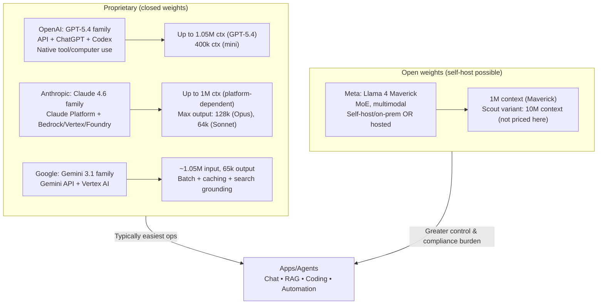
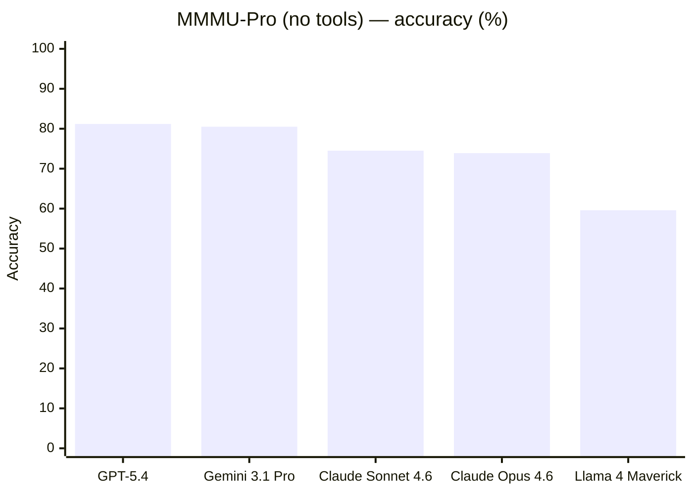

# Objective Comparative Review of Popular LLMs

## Executive summary

EN: This report compares leading, widely deployed LLMs from entity["organization","OpenAI","ai lab"], entity["organization","Anthropic","ai safety company"], entity["organization","Google DeepMind","research lab"], and entity["organization","Meta Platforms","social media company"], using a pragmatic deployment-cost view for open‑weight models via entity["company","Amazon Web Services","cloud provider"] where per‑token pricing is available. The current snapshot date assumed for “what’s available” and pricing is **2026‑03‑18** (Europe/Vilnius). Model capabilities and prices are volatile; the numbers below are sourced from vendor docs/cards and may change. citeturn13view0turn35view0turn34view0turn30view0turn44view0turn45search2  

EN: If you need **frontier “agentic” work** (tool use, long-horizon coding, computer use), current vendor-facing positioning places **GPT‑5.4** and **Claude Opus 4.6** at the top tier, with **Gemini 3.1 Pro** presenting a strong alternative—especially where you can exploit long context and multimodal inputs inside Google’s ecosystem. citeturn13view0turn19view0turn30view0  

EN: In **API cost terms**, the frontier‑class proprietary models vary widely: GPT‑5.4 is listed at **$2.50 / $15.00 per 1M input/output tokens**, Claude Opus 4.6 at **$5 / $25**, Claude Sonnet 4.6 at **$3 / $15**, and Gemini 3.1 Pro Preview at **$2 / $12** for prompts ≤200k tokens (higher rates apply above 200k). Fast/priority modes can materially change latency and cost. citeturn11view0turn35view0turn34view0turn36view0  

EN: For **high-volume** workloads, the “small frontier” segment (e.g., GPT‑5.4 mini; Gemini 3.1 Flash‑Lite) offers an order of magnitude better $/task when your problem does not require maximal reasoning depth. GPT‑5.4 mini lists **400k context** and **128k max output** at **$0.75 / $4.50 per 1M**; Gemini 3.1 Flash‑Lite Preview lists **1,048,576 input** and **65,536 output** limits at **$0.25 / $1.50 per 1M**. citeturn49view0turn34view0turn50search0  

EN: For **open‑weight deployment**, Meta’s Llama 4 family provides explicit parameter and context disclosures (e.g., Maverick with **17B activated / 400B total**, **1M context**), and published benchmark numbers—but you must manage hosting, security hardening, and compliance yourself. citeturn44view0  

RU: В отчёте сопоставляются популярные продакшн‑LLM от OpenAI, Anthropic, Google DeepMind и Meta; для open‑weight моделей стоимость иллюстрируется через AWS, где есть официальная тарификация по токенам. Дата среза: 18.03.2026 (Europe/Vilnius). Цены/версии меняются часто; ниже — только то, что подтверждено источниками. citeturn13view0turn35view0turn34view0turn30view0turn44view0turn45search2  

RU: Для “агентных” задач (инструменты, длинный цикл, компьютер‑use) по публичному позиционированию лидируют GPT‑5.4 и Claude Opus 4.6; Gemini 3.1 Pro — сильная альтернатива, особенно в экосистеме Google и при длинном контексте/мультимодальности. citeturn13view0turn19view0turn30view0  

## Scope and methodology

EN: Model selection focuses on **widely referenced, currently documented** models with (a) public model cards/system cards or (b) an official pricing/spec page accessible without private access. Where a vendor does not disclose parameters/architecture details, this report labels them **“not publicly disclosed”** and (only if needed) makes clearly marked assumptions. citeturn30view0turn31view0turn35view0turn44view0turn49view0  

EN: Benchmark numbers are taken from **vendor model cards/system cards** (which often include explicit evaluation conditions) and from **original benchmark publications/maintainers** to describe test intent. Cross-vendor comparisons are *not automatically apples-to-apples* because tool use, prompt formats, number of trials, and “thinking” settings differ across reports. This is explicitly called out where relevant. citeturn37view1turn30view0turn48search0turn48search1turn48search2turn48search3  

RU: Модели выбраны по принципу: есть официальные спецификации/цены и/или model card/system card. Если параметры/архитектура не раскрыты, это помечается как “не раскрыто”, а допущения делаются только явно. citeturn30view0turn31view0turn35view0turn44view0turn49view0  

RU: Бенчмарки берутся из model/system cards и первоисточников бенчмарков (описание методики). Сравнение “между вендорами” не гарантирует одинаковые условия (tools, thinking, число прогонов и т. п.), поэтому ограничения проговариваются. citeturn37view1turn30view0turn48search0turn48search1turn48search2turn48search3  

## Comparative snapshot of models

EN: The table below emphasises (1) **context/output limits**, (2) **pricing**, and (3) **deployment shape** (closed API vs multi‑cloud vs open weights). Where “architecture type” is not officially stated, it is marked as **assumption**. citeturn11view0turn49view0turn36view0turn34view0turn49view2turn50search0turn44view0turn45search2  

RU: Таблица ниже фокусируется на (1) контексте/лимитах вывода, (2) цене, (3) вариантах деплоя. Если тип архитектуры не указан официально — стоит пометка “допущение”. citeturn11view0turn49view0turn36view0turn34view0turn49view2turn50search0turn44view0turn45search2  

### Comparative table

| Vendor | Model | Release / snapshot | Architecture (public) | Params (public) | Context window (input) | Max output | Modalities | Official price (USD) input / output | Deployment options (high-level) |
|---|---|---:|---|---:|---:|---:|---|---:|---|
| OpenAI | GPT‑5.4 (`gpt-5.4`) | Snapshot `gpt-5.4-2026-03-05` (blog: 2026‑03‑05) | Not disclosed (assume autoregressive Transformer) | Not disclosed | 1,050,000 | 128,000 | Text + image input | $2.50 / $15.00 per 1M | API + Codex + ChatGPT; tool use incl. computer tool (native) |
| OpenAI | GPT‑5.4 mini (`gpt-5.4-mini`) | Snapshot `gpt-5.4-mini-2026-03-17` | Not disclosed (assume autoregressive Transformer) | Not disclosed | 400,000 | 128,000 | Text + image input | $0.75 / $4.50 per 1M | API; “mini” high‑volume workloads; **no fine‑tuning** (distillation supported) |
| Anthropic | Claude Opus 4.6 (`claude-opus-4-6`) | Feb 2026 (system cards list) | Not disclosed (vendor describes “hybrid reasoning”) | Not disclosed | 1,000,000 (beta; platform-dependent) | 128,000 | Multimodal (vision/tool use supported) | $5 / $25 per 1M | Claude Platform; also Bedrock / Vertex / Microsoft Foundry (1M context beta on Claude Platform) |
| Anthropic | Claude Sonnet 4.6 (`claude-sonnet-4-6`) | Feb 2026 | Not disclosed (“hybrid reasoning”) | Not disclosed | 1,000,000 | 64,000 | Multimodal (vision/tool use supported) | $3 / $15 per 1M | Claude Platform; enterprise integrations; “effort” controls for cost/latency |
| Anthropic | Claude Haiku 4.5 (`claude-haiku-4-5`) | Oct 2025 (system cards list) | Not disclosed | Not disclosed | Not clearly stated in accessible static docs (assume smaller than 1M) | Not stated | Text (likely multimodal features vary by platform) | $1 / $5 per 1M | Lowest‑cost Claude family option; batch + caching supported (per pricing table) |
| Google | Gemini 3.1 Pro Preview (`gemini-3.1-pro-preview`) | Docs updated 2026‑02‑19; model card published 2026‑02‑19 | Based on Gemini 3 Pro (Sparse MoE Transformer) | Not disclosed | 1,048,576 | 65,536 | Text + image + video + audio + PDF | $2 / $12 per 1M (≤200k prompt); $4 / $18 (>200k) | Gemini API + Vertex AI; caching + batch; search grounding |
| Google | Gemini 3.1 Flash‑Lite Preview (`gemini-3.1-flash-lite-preview`) | Latest update March 2026 | Gemini 3 family (architecture not detailed here) | Not disclosed | 1,048,576 | 65,536 | Text + image + video + audio + PDF | $0.25 / $1.50 per 1M | Gemini API + Vertex AI; positioned for lowest latency/high volume |
| Meta | Llama 4 Maverick (open weights; via Bedrock example pricing) | Model release date 2025‑04‑05 | Autoregressive MoE w/ early fusion (native multimodality) | 17B activated / 400B total | 1,000,000 | Not specified in card excerpt | Text + image in; text/code out | Example: Bedrock on‑demand ≈ $0.24 / $0.97 per 1M | Open‑weight self‑host/on‑prem; also available hosted (e.g., Bedrock) |

Sources: specs/pricing per model are drawn from the cited model pages, pricing tables, and model cards/system cards. citeturn11view0turn49view0turn13view0turn36view0turn35view0turn25view0turn34view0turn49view2turn50search0turn31view0turn44view0turn45search2  

### Architecture and deployment map

EN: This diagram is a “decision topology”: if you need vendor‑managed reliability, compliance artefacts, and fastest time‑to‑production, the closed‑API models dominate; if you need maximal control (e.g., strict on‑prem), open weights dominate, at the expense of engineering and governance overhead. citeturn13view0turn19view0turn30view0turn44view0turn45search2  

RU: Диаграмма — про выбор стратегии: закрытые API обычно быстрее в продакшн‑внедрении (операционка/сертификации у вендора), open‑weights дают контроль (вплоть до on‑prem), но повышают стоимость владения и ответственность за безопасность/комплаенс. citeturn13view0turn19view0turn30view0turn44view0turn45search2  

## Model-by-model analysis

EN: For each model below, “strengths/weaknesses” are grounded in (a) vendor‑stated intended use and (b) benchmark evidence where available. Where a detail is not public (e.g., parameter count for proprietary models), it is marked as not disclosed. citeturn13view0turn19view0turn30view0turn36view0turn44view0turn37view1  

RU: Для каждой модели ниже сильные/слабые стороны опираются на (а) позиционирование вендора и (б) измеримые результаты на бенчмарках. Нераскрытые детали помечаются как “не раскрыто”. citeturn13view0turn19view0turn30view0turn36view0turn44view0turn37view1  

EN: **OpenAI GPT‑5.4** is positioned as a frontier model for professional knowledge work, coding, and native computer‑use agents, with up to ~1M context in the API and a broad evaluation suite reported in its release post (including coding, tool use, and “academic” evaluations). Key trade‑off: you pay more per output token than for “mini”/throughput‑optimised options, but you get the strongest “do the whole job” behaviour in the OpenAI lineup. citeturn13view0turn11view0turn14view2  

RU: **OpenAI GPT‑5.4** позиционируется как флагман для профессиональных задач, кодинга и “computer use” агентов, с контекстом порядка 1M токенов в API и широкой линейкой оценок в релиз‑посте. Компромисс: более дорогие выходные токены по сравнению с mini‑вариантами, но сильнее “end‑to‑end выполнение работы”. citeturn13view0turn11view0turn14view2  

EN: **OpenAI GPT‑5.4 mini** is explicitly framed as the “strongest mini model” for coding, computer use, and subagents, with a smaller (but still very large) 400k context window and 128k output. It is materially cheaper than GPT‑5.4 per token, and listed as “fast”; however, it does **not** support fine‑tuning (but supports distillation). This tends to make it a default candidate for high‑volume SaaS chat, batch document transformation, and agent substeps, provided quality is sufficient. citeturn49view0  

RU: **GPT‑5.4 mini** — “mini‑флагман” для кодинга/компьютер‑use/субагентов: 400k контекст и 128k вывод, заметно дешевле GPT‑5.4 и заявлен как быстрый. Fine‑tuning не поддерживается (distillation поддерживается), что важнее для команд, которые рассчитывали на дообучение под стиль/форматы. citeturn49view0  

EN: **Claude Opus 4.6** is marketed as a premium model for advanced coding, complex agentic workflows, and high‑stakes enterprise tasks, with explicit mention of hybrid reasoning controls. Public benchmarking on its product page highlights Terminal‑Bench 2.0 and OSWorld performance; a separate system card (not directly accessible here) is referenced, and Sonnet’s system card provides comparative numbers for several shared benchmarks. Operationally important detail: Anthropic notes the 1M context window is (at least at the time of posting) **beta and Claude‑Platform‑only**, despite availability on Bedrock/Vertex/Foundry. citeturn19view0turn37view1turn36view0  

RU: **Claude Opus 4.6** подаётся как премиум‑модель для сложного кодинга и агентных цепочек, с управляемой “глубиной” рассуждений. Публично подсвечиваются Terminal‑Bench и OSWorld; сравнительные цифры по ряду бенчмарков видны в system card Sonnet 4.6. Практически важно: 1M контекст указан как beta и доступный только на Claude Platform (в то время как через Bedrock/Vertex/Foundry доступность может отличаться). citeturn19view0turn37view1turn36view0  

EN: **Claude Sonnet 4.6** is positioned as the best speed/intelligence balance in Claude 4.6, supporting a 1M context window and 64k output, plus “effort” controls intended to let developers trade latency and cost against quality. Anthropic’s system card includes cross‑developer results for SWE‑bench Verified, Terminal‑Bench 2.0, GPQA Diamond, and multimodal MMMU‑Pro (among others) under specified settings (adaptive thinking, max effort, default sampling; averages across multiple trials). citeturn36view0turn37view1  

RU: **Claude Sonnet 4.6** — “золотая середина” по скорости/интеллекту в линейке Claude 4.6: 1M контекст, 64k вывод и параметр effort для баланса цена/латентность/качество. В system card даны сопоставимые с другими разработчиками цифры по SWE‑bench Verified, Terminal‑Bench 2.0, GPQA Diamond, MMMU‑Pro и др., с описанными условиями прогона. citeturn36view0turn37view1  

EN: **Claude Haiku 4.5** is the low‑cost Claude tier in the official pricing table. It is typically most suitable for classification, short extraction, templated responses, and agent “glue” steps where the cheap output token price matters. Public docs in this accessible set do **not** clearly state Haiku 4.5’s context/output limits; this report assumes they are below the 4.6 flagship limits and flags the exact numbers as “unspecified”. citeturn35view0turn25view0  

RU: **Claude Haiku 4.5** — бюджетный уровень Claude в официальной таблице цен. Обычно его место — классификация/извлечение/шаблонные ответы и дешёвые “склейки” в агентных пайплайнах. В доступных источниках здесь не найдено однозначных лимитов контекста/вывода для Haiku 4.5; поэтому точные числа отмечены как “не указано”. citeturn35view0turn25view0  

EN: **Gemini 3.1 Pro Preview** is described as a refined/updated variant of the Gemini 3 Pro line, optimised for software engineering and agentic workflows, supporting multimodal inputs (text/image/video/audio/PDF) with 1,048,576 input tokens and 65,536 output tokens. Google’s Gemini 3.1 Pro model card publishes a large benchmark table with explicit “thinking” settings and tool/no‑tool variants, including comparisons to Claude 4.6 and GPT‑5.2 for several benchmarks. Pricing is tiered by prompt size (≤200k vs >200k tokens), which is operationally relevant for very long‑context use. citeturn49view2turn30view0turn34view0turn31view0  

RU: **Gemini 3.1 Pro Preview** — обновление линии Gemini 3 Pro, с упором на software engineering и agentic‑поведение; поддерживает мультимодальный вход и лимиты 1,048,576/65,536 по входу/выходу. Model card даёт большой набор бенчмарков и сравнений с Claude 4.6 и GPT‑5.2 (но важно помнить про различия условий). Цена зависит от длины промпта (≤200k и >200k), что критично для “очень длинного контекста”. citeturn49view2turn30view0turn34view0turn31view0  

EN: **Gemini 3.1 Flash‑Lite Preview** is explicitly positioned as the cost‑efficient, fastest option for high‑frequency lightweight tasks (translation, extraction, low‑latency apps), while still supporting multimodal inputs and “thinking” controls. Its model page lists the same 1,048,576 input and 65,536 output limits as Pro Preview. Google’s announcement claims strong speed improvements (TTFAT and output speed), citing an external benchmarking source. citeturn50search0turn34view0turn50search4  

RU: **Gemini 3.1 Flash‑Lite Preview** — самый дешёвый/быстрый вариант для высокочастотных лёгких задач (перевод, извлечение, низкая латентность), но с мультимодальным входом и настройками thinking. На странице модели указаны лимиты 1,048,576/65,536. В анонсе заявлены ускорения по времени до “первого ответного токена” и скорости генерации, со ссылкой на внешние измерения. citeturn50search0turn34view0turn50search4  

EN: **Llama 4 Maverick (open weights)** is a mixture‑of‑experts model with explicit public disclosure: 17B activated parameters (400B total), 1M context, and an Aug 2024 knowledge cutoff. Meta publishes benchmark numbers (e.g., MMLU‑Pro and MMMU‑Pro for multimodal reasoning) in the model card. The core strength is deployability and control (self‑host/on‑prem), but this comes with governance burden: you must implement safety filters, monitoring, and prompt‑injection defences in your own stack, and comply with the Llama 4 Community License (including special terms for very large MAU products). citeturn44view0turn48search3turn48search0  

RU: **Llama 4 Maverick (open weights)** — MoE‑модель с прозрачными публичными параметрами: 17B активных (400B всего), 1M контекст, cutoff Aug 2024. В model card опубликованы бенчмарки (включая MMLU‑Pro и MMMU‑Pro). Сильная сторона — контроль и возможность self‑host/on‑prem; обратная сторона — вы сами отвечаете за safety‑обвязку, мониторинг, защиту от prompt injection и соблюдение лицензии Llama 4 (включая отдельные условия для сверхкрупных продуктов). citeturn44view0turn48search3turn48search0  

## Cost modelling and latency/cost trade-offs

EN: **Token pricing conventions.** Vendors quote prices per **1M tokens**; this section also shows $/1K tokens for readability. For models that explicitly price “thinking tokens” as part of output (e.g., Gemini), your billed output can exceed the visible answer length when you increase reasoning depth. citeturn34view0turn50search0turn49view0  

RU: **Про токены и тарифы.** Обычно цены даются за **1M токенов**; ниже также есть $/1K. Если “thinking tokens” тарифицируются как часть output (как у Gemini), счёт за output может быть выше, чем видимый текст ответа. citeturn34view0turn50search0turn49view0  

### Unit prices

| Model | Input $/1K | Output $/1K | Notes |
|---|---:|---:|---|
| GPT‑5.4 | 0.00250 | 0.01500 | Context 1.05M; output 128k citeturn11view0 |
| GPT‑5.4 mini | 0.00075 | 0.00450 | Context 400k; output 128k; fine‑tuning not supported citeturn49view0 |
| Claude Opus 4.6 | 0.00500 | 0.02500 | 1M context (platform-dependent); “fast mode” exists at premium citeturn35view0turn36view0turn19view0 |
| Claude Sonnet 4.6 | 0.00300 | 0.01500 | 1M context; effort parameter for cost/latency trade‑off citeturn35view0turn36view0 |
| Claude Haiku 4.5 | 0.00100 | 0.00500 | Lowest cost Claude tier citeturn35view0turn25view0 |
| Gemini 3.1 Pro Preview (≤200k) | 0.00200 | 0.01200 | Above 200k has premium rates citeturn34view0turn49view2 |
| Gemini 3.1 Flash‑Lite Preview | 0.00025 | 0.00150 | Positioned for high‑volume + low latency citeturn34view0turn50search0turn50search4 |
| Llama 4 Maverick (Bedrock example) | 0.00024 | 0.00097 | On-demand example per AWS blog calculation citeturn45search2 |

### Cost-per-task example table

Assumed billable token scenarios:
- Short chat: **300 input + 300 output** tokens  
- Long summarisation: **20,000 input + 2,000 output** tokens  
- Code generation: **2,000 input + 4,000 output** tokens  

| Model | Short chat (USD) | Long summarisation (USD) | Code generation (USD) |
|---|---:|---:|---:|
| GPT‑5.4 | 0.00525 | 0.08000 | 0.06500 |
| GPT‑5.4 mini | 0.00157 | 0.02400 | 0.01950 |
| Claude Opus 4.6 | 0.00900 | 0.15000 | 0.11000 |
| Claude Sonnet 4.6 | 0.00540 | 0.09000 | 0.06600 |
| Claude Haiku 4.5 | 0.00180 | 0.03000 | 0.02200 |
| Gemini 3.1 Pro Preview | 0.00420 | 0.06400 | 0.05200 |
| Gemini 3.1 Flash‑Lite Preview | 0.00052 | 0.00800 | 0.00650 |
| Llama 4 Maverick (Bedrock example) | 0.00036 | 0.00674 | 0.00436 |

EN: **Worked example (long summarisation, GPT‑5.4).**  
Cost = (20,000 / 1,000,000 × $2.50) + (2,000 / 1,000,000 × $15.00)  
= $0.0500 + $0.0300 = **$0.0800**. citeturn11view0  

RU: **Пример расчёта (длинная выжимка, GPT‑5.4).**  
Цена = (20,000 / 1,000,000 × $2.50) + (2,000 / 1,000,000 × $15.00) = **$0.0800**. citeturn11view0  

### Latency/cost trade-offs that materially affect real bills

EN: **Reasoning depth → latency and billed tokens.** Claude 4.6 introduces “adaptive thinking” plus an “effort” parameter specifically framed for cost‑quality trade‑offs, and its “fast mode” sells lower latency at ~6× pricing for Opus 4.6. citeturn36view0turn35view0  

EN: **Vendor acceleration tiers.** OpenAI describes /fast mode in Codex and “priority processing” as ways to increase speed for GPT‑5.4; Google positions Flash‑Lite for very low latency and claims large speed gains over prior generation. These features can dominate user-perceived performance more than raw model intelligence does. citeturn13view0turn50search4  

EN: **Batch and caching can halve (or better) effective cost** when your workload is asynchronous or has repeated context. Gemini and Claude both explicitly price batch/caching mechanisms; Anthropic’s Batch API is documented as a 50% discount, and Gemini Pro pricing distinguishes prompt size tiers and has batch prices. citeturn35view0turn34view0turn40search5  

RU: **Глубина рассуждения → латентность и счёт за токены.** У Claude 4.6 есть adaptive thinking + параметр effort, а “fast mode” продаёт скорость примерно за 6× цены. citeturn36view0turn35view0  

RU: **Ускоряющие режимы.** OpenAI описывает /fast и priority processing для GPT‑5.4; Google продвигает Flash‑Lite как ультра‑низкую латентность и заявляет существенные ускорения. На практике такие режимы часто важнее “чуть лучшей точности” на бенчмарках. citeturn13view0turn50search4  

RU: **Batch + caching** сильно меняют экономику, если вы можете выполнять запросы асинхронно или переиспользовать контекст. В документации Claude batch — это 50% скидка; у Gemini есть batch‑цены и разные тарифы для длинных промптов. citeturn35view0turn34view0turn40search5  

## Benchmark comparison

EN: This section uses (a) benchmark definitions from primary sources and (b) model/system cards for numeric results and test conditions. Key benchmark intent summaries: SWE‑bench tests patch generation for real GitHub issues; GPQA is a graduate‑level science multiple‑choice dataset; MMMU and MMMU‑Pro test multimodal understanding across disciplines; MMLU‑Pro is a harder multi‑domain reasoning‑focused extension of MMLU with 10 choices. citeturn48search1turn48search2turn48search8turn48search0turn48search3  

RU: Здесь используются (а) первоисточники бенчмарков и (б) model/system cards для чисел и условий. Коротко: SWE‑bench — фиксы реальных GitHub issues; GPQA — сложные научные вопросы; MMMU/MMMU‑Pro — мультимодальное понимание; MMLU‑Pro — усложнённый MMLU с 10 вариантами ответа и более “reasoning‑heavy” вопросами. citeturn48search1turn48search2turn48search8turn48search0turn48search3  

### Comparable benchmark slice: MMMU‑Pro (no tools)

EN: MMMU‑Pro is designed to reduce shortcuts/gameability in MMMU via filtering, option augmentation, and vision‑only settings, aiming to better measure true multimodal reasoning. The chart below uses the **“no tools”** MMMU‑Pro numbers as reported in the cited model/system cards; note that reporting settings (e.g., “thinking level”) still differ by vendor. citeturn48search0turn14view2turn30view0turn37view1turn44view0  

RU: MMMU‑Pro усложняет MMMU и снижает “чит‑пути” (фильтрация вопросов, больше дистракторов, режим vision‑only). Ниже — значения MMMU‑Pro **без инструментов** из model/system cards; при этом параметры “thinking” по вендорам всё равно различаются. citeturn48search0turn14view2turn30view0turn37view1turn44view0  

Numbers source mapping: GPT‑5.4 (81.2) citeturn14view2; Gemini 3.1 Pro (80.5) citeturn30view0; Claude Sonnet 4.6 (74.5) + Opus 4.6 (73.9) citeturn37view1; Llama 4 Maverick (59.6) citeturn44view0  

### Cross-model table excerpt: coding + science + long-horizon agent tasks

EN: The following values are included because they are reported *side‑by‑side with stated conditions* in vendor documents, which is relatively rare; treat them as informative but not definitive cross‑vendor rankings. citeturn37view1turn30view0turn13view0  

RU: Данные ниже ценны тем, что даны “рядом” для нескольких разработчиков с описанными условиями. Но это всё равно не идеальная “лабораторная” сравнимость. citeturn37view1turn30view0turn13view0  

- **SWE‑bench Verified** (real GitHub issues; patch must resolve the problem). citeturn48search1turn48search5  
  Reported examples: Claude Opus 4.6 **80.8%**, Claude Sonnet 4.6 **79.6%**, Gemini 3 Pro **76.2%**, GPT‑5.2 **80.0%** (Anthropic system card table; SWE‑bench averaged over 25 trials). citeturn37view1  
  Gemini 3.1 Pro reports **80.6%** (single attempt) in its model card table. citeturn30view0  

- **GPQA Diamond** (hard subset of GPQA; science MCQ). citeturn48search2turn48search6  
  Gemini 3.1 Pro reports **94.3%** (no tools) and GPT‑5.2 **92.4%**; Anthropic’s table shows GPT‑5.2 **93.2%** and Claude Opus 4.6 **91.3%**—illustrating that reported numbers can vary by evaluation harness/report. citeturn30view0turn37view1  
  GPT‑5.4 reports **92.8%** (GPQA Diamond) in OpenAI’s evaluation table. citeturn14view1  

- **Terminal‑Bench 2.0** (agentic terminal coding).  
  Gemini 3.1 Pro reports **68.5%** (Terminus‑2 harness) and Claude Opus 4.6 **65.4%** in its benchmark table; OpenAI reports GPT‑5.4 **75.1%** (with GPT‑5.3‑Codex at **77.3%**) in its own evaluation table. citeturn30view0turn37view1turn14view2  

## Safety, guardrails, known failure modes, privacy/compliance

EN: The most operationally relevant risk classes for LLM deployments in 2026 are still: (1) **hallucination/factual errors**; (2) **jailbreaks and prompt injection** (especially for agents and RAG); (3) **tool/action errors** (models taking unsafe actions or misreading UI); and (4) **data governance failures** (training/retention surprises). Each vendor documents mitigation levers, but none remove the need for product-side guardrails. citeturn31view0turn40search15turn37view3turn13view0turn39search1turn38search0  

RU: Для продакшн‑LLM в 2026 ключевые риски всё ещё: (1) галлюцинации/фактические ошибки; (2) jailbreak/prompt injection (особенно у агентов и RAG); (3) ошибки инструментов/действий; (4) ошибки data governance (неожиданное обучение/ретеншн). Вендоры дают рычаги, но продуктовые защитные меры всё равно обязательны. citeturn31view0turn40search15turn37view3turn13view0turn39search1turn38search0  

### Guardrails and documented failure modes

EN: **Hallucinations and jailbreaks are explicitly acknowledged** in Google’s Gemini 3 Pro model card: it lists hallucinations as a general limitation and calls jailbreak vulnerability an ongoing risk area. citeturn31view0  

EN: **Prompt injection robustness** is treated as a first‑class safety topic in Anthropic’s Claude Sonnet 4.6 system card, including an “Indirect Prompt Injection Robustness” figure derived from an Agent Red Teaming benchmark (lower is better) and discussions of adaptive red teaming. citeturn37view3turn23view0  

EN: **Chain-of-thought monitoring** appears as a safety mechanism in OpenAI’s GPT‑5.4 release post, which states that GPT‑5.4 Thinking’s ability to control its chain‑of‑thought is low (presented as positive for safety and monitoring effectiveness). OpenAI also reports reduced factual errors relative to prior versions on internal de‑identified prompt sets. citeturn14view3turn13view0  

RU: **Галлюцинации и jailbreaks** явно упоминаются в model card Gemini 3 Pro (как ограничения/риски). citeturn31view0  

RU: **Устойчивость к prompt injection** подробно измеряется в system card Claude Sonnet 4.6, включая график “Indirect Prompt Injection Robustness” и описание адаптивного red teaming. citeturn37view3turn23view0  

RU: **Мониторинг chain‑of‑thought** упоминается у OpenAI: в релизе GPT‑5.4 говорится, что способность модели контролировать CoT низкая (это трактуется как плюс для безопасности), а также заявляется снижение фактических ошибок относительно предыдущей версии на внутренних наборах. citeturn14view3turn13view0  

### Privacy and compliance notes (high signal)

EN: **OpenAI API / business products:** OpenAI states that, as of 2023‑03‑01, data sent to the API is not used for training unless you opt in; likewise business offerings are opted out by default. OpenAI also publicly lists SOC 2 Type 2 and multiple ISO certifications covering its API and business services. citeturn38search0turn38search2turn38search5turn38search6  

EN: **Anthropic commercial products (including API):** Anthropic’s privacy centre states commercial inputs/outputs are not used for training by default; Anthropic also offers a Zero Data Retention (ZDR) mode for certain endpoints by arrangement, describing near‑immediate discard of prompts/outputs except for legal/misuse exceptions. Compliance artefacts are distributed via its trust centre. citeturn39search7turn39search1turn39search2turn39search6  

EN: **Google Gemini API vs Vertex AI:** Google’s Gemini API pricing page distinctions explicitly show “Used to improve our products: Yes” on free tier and “No” on paid tier for model usage; for Vertex AI, Google documents a “training restriction” stating it won’t use customer data to train or fine‑tune models without prior permission/instruction. Gemini API logs and data handling are also documented separately. citeturn34view0turn40search2turn40search5  

EN: **Open‑weight deployment (Llama 4):** The Llama 4 model card discloses that training data includes public and licensed data plus information from Meta’s products/services, and provides licensing terms (including special conditions for organisations above a threshold MAU). From a compliance standpoint, your risk profile depends heavily on where you host and how you log; open weights are not automatically “privacy‑safe”—they are “control‑capable.” citeturn44view0  

RU: **OpenAI API/бизнес‑продукты:** заявлено, что данные API не используются для обучения по умолчанию (если не включить opt‑in); также перечислены SOC 2 Type 2 и ISO‑сертификации для API и бизнес‑сервисов. citeturn38search0turn38search2turn38search5turn38search6  

RU: **Anthropic коммерческие продукты (включая API):** в privacy‑центре указано, что данные не идут в обучение по умолчанию; также есть режим Zero Data Retention (по условиям договора) с удалением данных сразу после ответа за исключением случаев закона/злоупотреблений. Сертификации — в trust centre. citeturn39search7turn39search1turn39search2turn39search6  

RU: **Gemini API vs Vertex AI:** на странице цен есть явное различие “используется для улучшения продуктов” (да для free, нет для paid); для Vertex AI документируется запрет на обучение/дообучение на данных клиента без разрешения. Политика логов выделена отдельно. citeturn34view0turn40search2turn40search5  

RU: **Open‑weights (Llama 4):** model card раскрывает источники данных, включая данные из продуктов Meta, и условия лицензии (включая MAU‑порог). Для комплаенса всё упирается в вашу инфраструктуру и логи: open weights не “автоматически приватны”, они “дают контроль”, но ответственность ваша. citeturn44view0  

## Conclusions

EN: Across the 2026‑03 snapshot, the most defensible “objective” positioning is:  
- **Frontier agent/coding capability**: GPT‑5.4 and Claude Opus 4.6 are explicitly marketed for this tier, and their published benchmark suites show strong performance on agentic and multimodal evaluations (with the usual caveats about comparability). citeturn13view0turn19view0turn14view2turn37view1  
- **Best value for throughput**: GPT‑5.4 mini and Gemini 3.1 Flash‑Lite meaningfully reduce cost per task in the example scenarios, and both keep very large context windows. citeturn49view0turn50search0turn34view0  
- **Enterprise document + multimodal + ecosystem fit**: Gemini 3.1 Pro is unusually well documented via model cards with a broad evaluation table and explicit multimodal IO, and its pricing is competitive up to 200k tokens—but becomes more expensive in the long‑context tier. citeturn30view0turn49view2turn34view0  
- **On‑prem / maximum control**: Llama 4 Maverick provides explicit architecture/parameter disclosure and open‑weight deployability, but shifts responsibility for safety, monitoring, and compliance to the operator. citeturn44view0turn45search2  

RU: Если резюмировать максимально “сухо” на срезе 03‑2026:  
- **Фронтирные агентные/кодинг‑задачи**: GPT‑5.4 и Claude Opus 4.6 явно нацелены на этот класс, и публичные наборы оценок подтверждают высокие результаты (с оговорками по сравнимости). citeturn13view0turn19view0turn14view2turn37view1  
- **Лучшая экономика для объёмов**: GPT‑5.4 mini и Gemini 3.1 Flash‑Lite дают наиболее низкую стоимость на типовых сценариях и сохраняют большие окна контекста. citeturn49view0turn50search0turn34view0  
- **Документы/мультимодальность/экосистема**: Gemini 3.1 Pro хорошо задокументирован (model cards + таблицы оценок), конкурентен по цене до 200k токенов, но дороже в long‑context тарифе. citeturn30view0turn49view2turn34view0  
- **On‑prem/контроль**: Llama 4 Maverick прозрачен по архитектуре/параметрам и позволяет self‑host, но переносит safety/мониторинг/комплаенс на владельца системы. citeturn44view0turn45search2